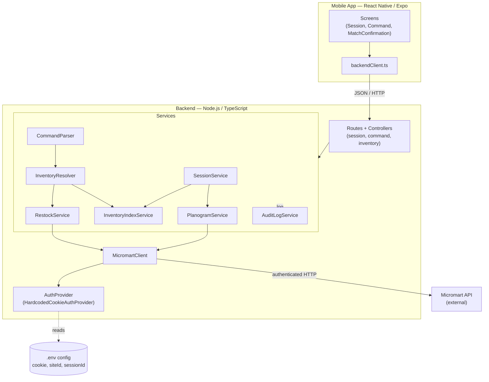
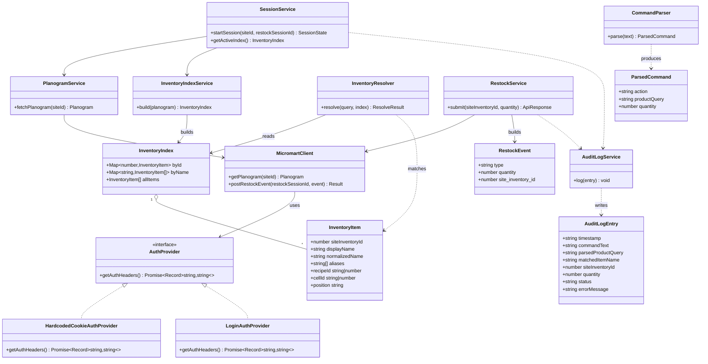
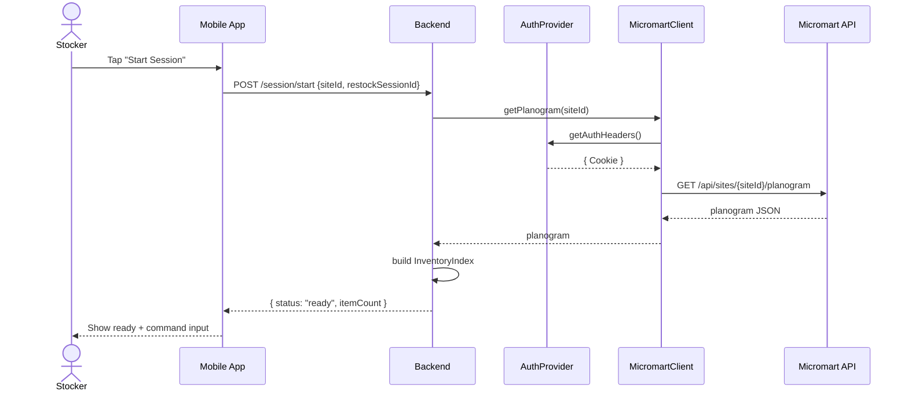
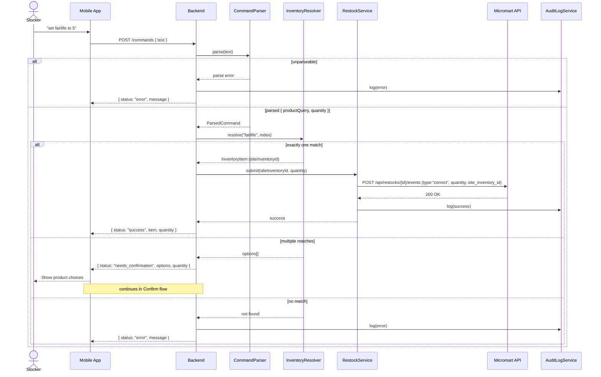
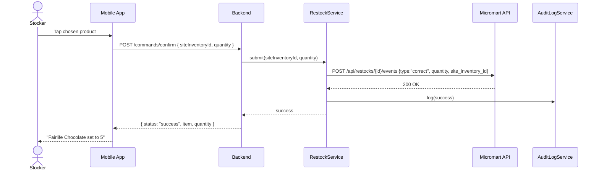

# Restock Assistant — UML Diagrams

UML views of the system described in [`restock_assistant_mvp_plan.md`](restock_assistant_mvp_plan.md).
Diagrams are written in [Mermaid](https://mermaid.js.org/) and render directly on GitHub.

---

## 1. Component Diagram

High-level boundaries: the mobile app talks only to our backend; the backend is
the only thing that talks to Micromart. `MicromartClient` owns external endpoints
and `AuthProvider` owns authentication.

---

## 2. Class Diagram (Backend)

Interfaces, services, and the core data models. `AuthProvider` is the seam that
lets a real login/2FA flow replace the hardcoded cookie later without touching
command, planogram, or restock logic.

---

## 3. Sequence Diagram — Start Session

---

## 4. Sequence Diagram — Command (success, ambiguous, error)

---

## 5. Sequence Diagram — Confirm Ambiguous Match

