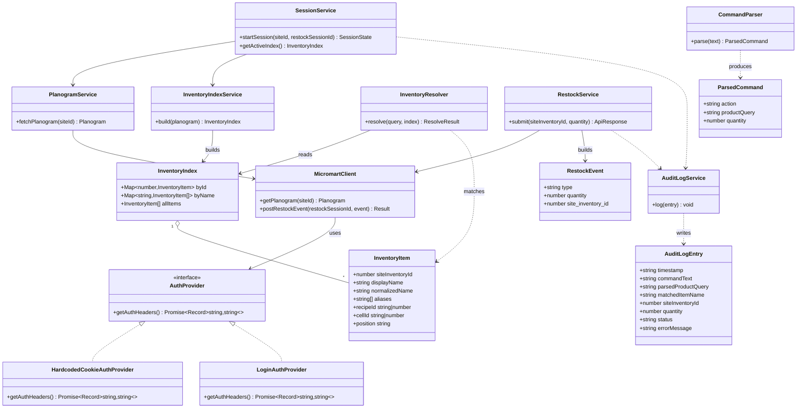
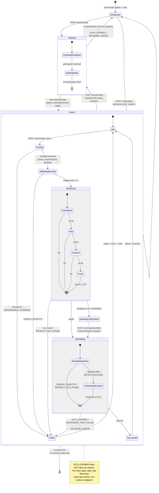
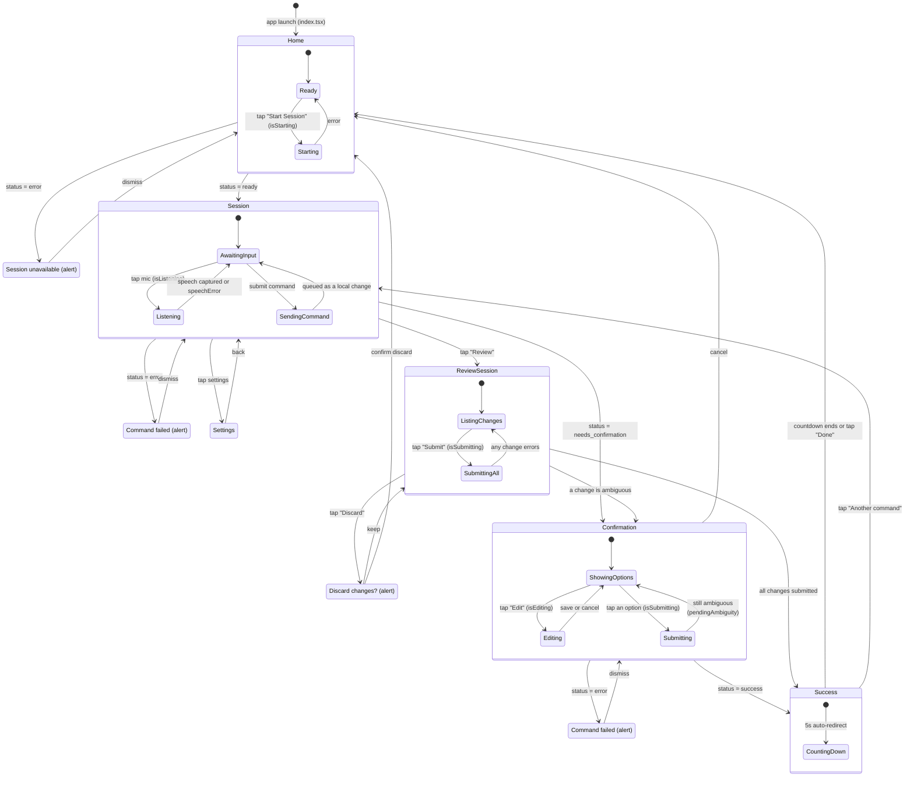

# Restock Assistant — UML Diagrams

UML views of the system described in [`restock_assistant_mvp_plan.md`](restock_assistant_mvp_plan.md).
Diagrams are written in [Mermaid](https://mermaid.js.org/) and render directly on GitHub.

Three diagrams, matching the two required views: a class diagram (§1) and
statechart diagrams for the backend (§2) and the mobile app (§3).

---

## 1. Class Diagram (Backend)

Interfaces, services, and the core data models. `AuthProvider` is the seam that
lets a real login/2FA flow replace the hardcoded cookie later without touching
command, planogram, or restock logic.

```mermaid
classDiagram
    class AuthProvider {
        <<interface>>
        +getAuthHeaders() Promise~Record~string,string~~
    }
    class HardcodedCookieAuthProvider {
        +getAuthHeaders() Promise~Record~string,string~~
    }
    class LoginAuthProvider {
        +getAuthHeaders() Promise~Record~string,string~~
    }
    AuthProvider <|.. HardcodedCookieAuthProvider
    AuthProvider <|.. LoginAuthProvider

    class MicromartClient {
        +getPlanogram(siteId) Planogram
        +postRestockEvent(restockSessionId, event) Result
    }
    MicromartClient --> AuthProvider : uses

    class SessionService {
        +startSession(siteId, restockSessionId) SessionState
        +getActiveIndex() InventoryIndex
    }
    class PlanogramService {
        +fetchPlanogram(siteId) Planogram
    }
    class InventoryIndexService {
        +build(planogram) InventoryIndex
    }
    class CommandParser {
        +parse(text) ParsedCommand
    }
    class InventoryResolver {
        +resolve(query, index) ResolveResult
    }
    class RestockService {
        +submit(siteInventoryId, quantity) ApiResponse
    }
    class AuditLogService {
        +log(entry) void
    }

    SessionService --> PlanogramService
    SessionService --> InventoryIndexService
    PlanogramService --> MicromartClient
    InventoryIndexService --> InventoryIndex : builds
    InventoryResolver --> InventoryIndex : reads
    RestockService --> MicromartClient
    RestockService --> RestockEvent : builds
    SessionService ..> AuditLogService
    RestockService ..> AuditLogService

    class InventoryItem {
        +number siteInventoryId
        +string displayName
        +string normalizedName
        +string[] aliases
        +recipeId string|number
        +cellId string|number
        +position string
    }
    class InventoryIndex {
        +Map~number,InventoryItem~ byId
        +Map~string,InventoryItem[]~ byName
        +InventoryItem[] allItems
    }
    class ParsedCommand {
        +string action
        +string productQuery
        +number quantity
    }
    class RestockEvent {
        +string type
        +number quantity
        +number site_inventory_id
    }
    class AuditLogEntry {
        +string timestamp
        +string commandText
        +string parsedProductQuery
        +string matchedItemName
        +number siteInventoryId
        +number quantity
        +string status
        +string errorMessage
    }

    InventoryIndex "1" o-- "*" InventoryItem
    CommandParser ..> ParsedCommand : produces
    InventoryResolver ..> InventoryItem : matches
    AuditLogService ..> AuditLogEntry : writes
```

---

## 2. Statechart — Backend Session and Command Processing

The single in-memory restock session owned by
[`SessionService`](../backend/src/services/sessionService.ts), with command
processing ([`CommandController`](../backend/src/controllers/commandController.ts))
nested inside the `Active` state — commands are only meaningful against a loaded
planogram, so `NoSession` is exactly what produces `SESSION_NOT_READY` (§17).

Every error transition is labeled with the `ErrorCode` the API actually returns,
and the three ways a command can end (`Succeeded`, `AwaitingConfirmation`,
`Failed`) map 1:1 to the `status` values in the API contract (§15).

```mermaid
stateDiagram-v2
    direction TB
    [*] --> NoSession : server start (active = null)

    NoSession --> NoSession : POST /commands<br/>SESSION_NOT_READY
    NoSession --> Starting : POST /session/start

    state Starting {
        direction TB
        [*] --> FetchingPlanogram
        FetchingPlanogram --> BuildingIndex : planogram received
        BuildingIndex --> [*] : InventoryIndex built
    }

    Starting --> NoSession : PLANOGRAM_FETCH_FAILED /<br/>AUTH_EXPIRED / NETWORK_ERROR
    Starting --> Active : store SessionState<br/>{siteId, restockSessionId, index}

    state Active {
        direction TB
        [*] --> Idle

        Idle --> Parsing : POST /commands { text }
        Parsing --> ValidatingQuantity : ParsedCommand<br/>{action, productQuery, quantity}
        Parsing --> Failed : ParseError<br/>UNPARSEABLE_COMMAND
        ValidatingQuantity --> Resolving : integer and >= 0
        ValidatingQuantity --> Failed : INVALID_QUANTITY

        state Resolving {
            direction TB
            [*] --> ExactName
            ExactName --> Alias : no hit
            Alias --> Contains : no hit
            Contains --> Fuzzy : no hit
            ExactName --> [*] : hit
            Alias --> [*] : hit
            Contains --> [*] : hit
            Fuzzy --> [*] : score >= 0.6
        }

        Resolving --> Submitting : single
        Resolving --> AwaitingConfirmation : ambiguous (2+ candidates)
        Resolving --> Failed : not_found<br/>PRODUCT_NOT_FOUND

        AwaitingConfirmation --> Submitting : POST /commands/confirm<br/>{ siteInventoryId, quantity }

        state Submitting {
            direction TB
            [*] --> RevalidatingIntent
            RevalidatingIntent --> PostingToMicromart : quantity valid<br/>and id in active index
            RevalidatingIntent --> [*] : INVALID_QUANTITY /<br/>PRODUCT_NOT_FOUND
            PostingToMicromart --> [*] : response or error
        }

        Submitting --> Succeeded : 200 OK
        Submitting --> Failed : AUTH_EXPIRED /<br/>MICROMART_POST_FAILED /<br/>NETWORK_ERROR

        Succeeded --> Idle : status = success
        Failed --> Idle : status = error + code
    }

    Active --> Starting : POST /session/start<br/>(replaces the active session)
    Active --> [*] : process exit<br/>(in-memory state lost)

    note right of Active
        AUTH_EXPIRED does NOT clear the session.
        The index stays valid; only Micromart
        writes fail until the .env cookie is replaced.
    end note
```

**`Resolving` is layered (§14).** Each layer runs only if the previous one found
nothing, and any layer returning 2+ items yields `ambiguous` — the resolver never
guesses between close matches.

**`AwaitingConfirmation` holds no server state.** The MVP is stateless between
`/commands` and `/commands/confirm`: the app carries the chosen `siteInventoryId`
and `quantity` back. `RevalidatingIntent` re-checks both against the active index,
which is the guard that makes trusting the client safe
([`restockService.ts`](../backend/src/services/restockService.ts)).

**Audit coverage (§18).** `AwaitingConfirmation` and every `Failed` transition are
logged by `CommandController`; `Succeeded` and submission-time failures are logged
by `RestockService`. No terminal state is unlogged.

---

## 3. Statechart — Mobile App Screen Flow

The Expo app's navigation and per-screen states, from
[`frontend/src/app/`](../frontend/src/app). Sub-states are the real `useState`
flags. Pop-ups are `Alert.alert` calls, modeled as states because the acceptance
test cases must capture each one.

```mermaid
stateDiagram-v2
    direction TB
    [*] --> Home : app launch (index.tsx)

    state "Session unavailable (alert)" as SessionUnavailableAlert
    state "Command failed (alert)" as CommandFailedAlert
    state "Command failed (alert)" as ConfirmFailedAlert
    state "Discard changes? (alert)" as DiscardAlert

    state Home {
        direction TB
        [*] --> Ready
        Ready --> Starting : tap "Start Session" (isStarting)
        Starting --> Ready : error
    }

    Home --> SessionUnavailableAlert : status = error
    SessionUnavailableAlert --> Home : dismiss
    Home --> Session : status = ready

    state Session {
        direction TB
        [*] --> AwaitingInput
        AwaitingInput --> Listening : tap mic (isListening)
        Listening --> AwaitingInput : speech captured or speechError
        AwaitingInput --> SendingCommand : submit command
        SendingCommand --> AwaitingInput : queued as a local change
    }

    Session --> CommandFailedAlert : status = error
    CommandFailedAlert --> Session : dismiss
    Session --> Confirmation : status = needs_confirmation
    Session --> Settings : tap settings
    Settings --> Session : back
    Session --> ReviewSession : tap "Review"

    state Confirmation {
        direction TB
        [*] --> ShowingOptions
        ShowingOptions --> Editing : tap "Edit" (isEditing)
        Editing --> ShowingOptions : save or cancel
        ShowingOptions --> Submitting : tap an option (isSubmitting)
        Submitting --> ShowingOptions : still ambiguous<br/>(pendingAmbiguity)
    }

    Confirmation --> ConfirmFailedAlert : status = error
    ConfirmFailedAlert --> Confirmation : dismiss
    Confirmation --> Success : status = success
    Confirmation --> Home : cancel

    state ReviewSession {
        direction TB
        [*] --> ListingChanges
        ListingChanges --> SubmittingAll : tap "Submit" (isSubmitting)
        SubmittingAll --> ListingChanges : any change errors
    }

    ReviewSession --> DiscardAlert : tap "Discard"
    DiscardAlert --> ReviewSession : keep
    DiscardAlert --> Home : confirm discard
    ReviewSession --> Confirmation : a change is ambiguous
    ReviewSession --> Success : all changes submitted

    state Success {
        direction TB
        [*] --> CountingDown : 5s auto-redirect
    }

    Success --> Home : countdown ends or tap "Done"
    Success --> Session : tap "Another command"
```

**Screens and pop-ups to capture for acceptance testing:** `Home`, `Session`,
`Confirmation`, `ReviewSession`, `Success`, `Settings`, plus the
`Session unavailable`, `Command failed`, and `Discard changes?` alerts.
